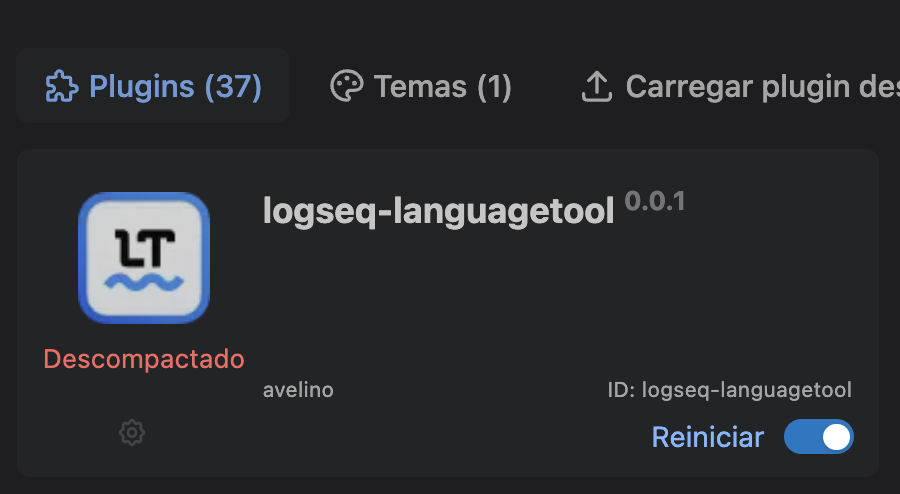

# Logseq LanguageTool Plugin

This is a plugin for [Logseq](https://logseq.com/) to check grammar and spelling using [LanguageeTool](https://languagetool.org/).

> ⚠️ **developing**: this plugin is still under development. It is not ready for production use.



## Develop

``` shell
yarn
yarn watch
```

* Enable developer mode in Logseq
* Click "Load unpacked plugin" to open this folder
* Click the "Reload" button to refresh latest changes

### Connect to the repl

Check https://shadow-cljs.github.io/docs/UsersGuide.html#cider.

## Release

``` shell
yarn release
```
